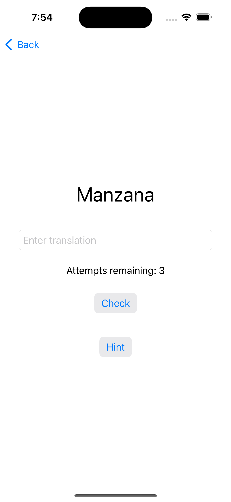
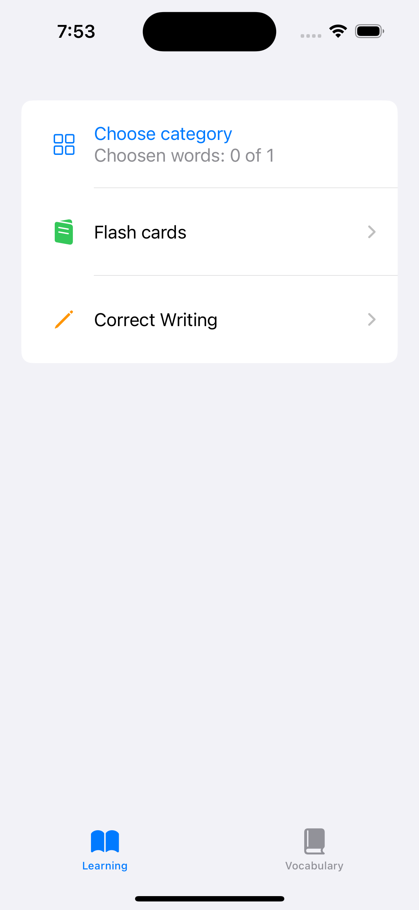
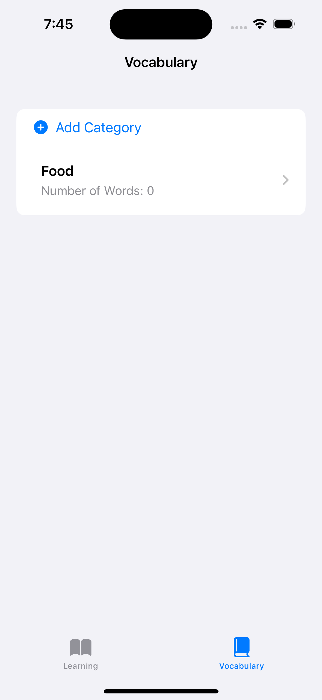
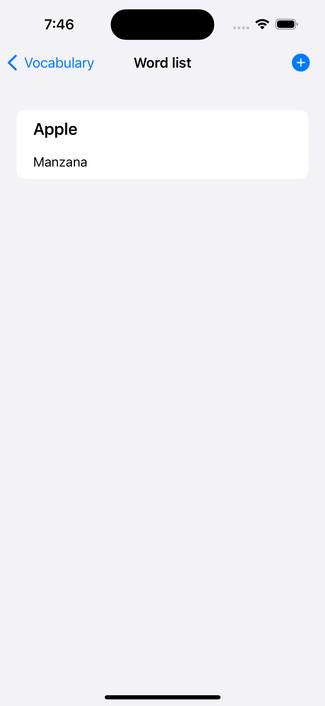

# VocabVerse
Welcome to VocabVerse!💫 This app helps you learn new words. 

## Key Features

With VocabVerse, you can take advantage of two dynamic learning modes:

- **Flash Cards**: A classic method for vocabulary acquisition.
- **Correct Writing Mode**: This feature challenges you to write the word you're learning correctly.

## Screenshots
| Correct Writing Mode                                                      | Flash Cards                                                      | Learning Page                                                      |
| ---------------------------------------------------------- | ---------------------------------------------------------- | ---------------------------------------------------------- |
|  |  |  |
| Vocabulary Screen                                      | Word List Screen                                                 |                                             |
|  |  |                                                            |

## Tech stack

- **Swift** - The programming language used to develop VocabVerse.
- **SwiftUI** - The user interface framework that enables elegant and declarative UI design for the app.
- **TCA (The Composable Architecture)** - TCA designed to help developers create more maintainable, testable, and scalable applications by promoting functional programming concepts and separating concerns in an application.
- **Core Data** - The persistent data framework utilized for managing and storing app data efficiently.

## How to install
- Clone this repo: `git@github.com:Sashazakh/VocabVerse.git`
- Open the workspace `VocabVerse.xcodeproj`
- Build the app

## Contribution
Feel free to contribute if you have any ideas or come across errors or typos! 

## Author
**Author**: Alexander Zakharov

[Linkedin](https://www.linkedin.com/in/alexandr-zakharov/)

